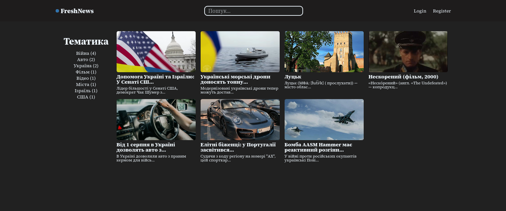
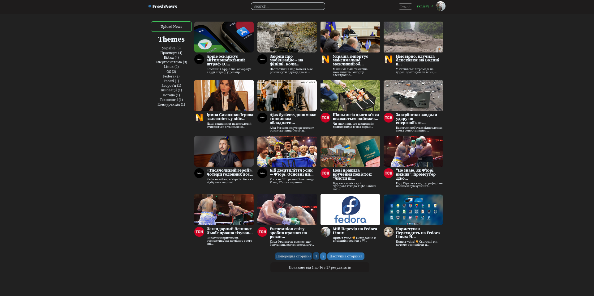

# FreshNews

News information system

An old type of information system, which was developed as a coursework.

A new type of information system, which was made as a practical experience

What's new:
-- the possibility of adding information about the user;
-- the possibility of editing the user's avatar;
-- small design changes.
